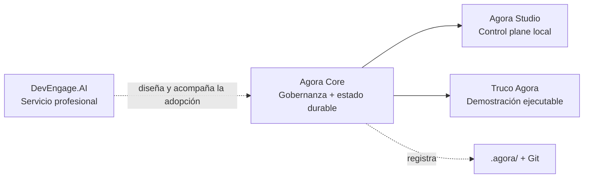

  

# ModernAsh — material comercial y arquitectura de oferta

Este repositorio centraliza la narrativa comercial de [ModernAsh](https://modern-ash.com/), sus servicios profesionales y su ecosistema de productos open source.

## Posicionamiento vigente

> **Modernizamos software. Gobernamos cómo se construye.**

ModernAsh trabaja sobre dos frentes complementarios:

1. **Modernización de sistemas críticos**: evaluación y modernización de COBOL, mainframe y Java legacy hacia arquitecturas modernas, testeadas y documentadas sobre AWS.
2. **Gobernanza del delivery con IA**: incorporación de humanos, agentes, servicios y swarms a procesos de desarrollo con roles, permisos, evidencia, gates y aprobaciones explícitas.

## Arquitectura de producto y servicios

| Oferta | Tipo | Rol |
| --- | --- | --- |
| [Agora](https://modern-ash.com/agora/) | Producto open source, Alpha `0.x` | Protocolo Markdown-first y Git-native para gobernar la ejecución del delivery |
| [DevEngage.AI](https://modern-ash.com/devengage/) | Servicio profesional | Assessment, diseño, piloto y adopción del delivery gobernado con Agora |
| Legacy Modernization | Servicio profesional | Modernización controlada de sistemas críticos y aplicaciones Java existentes |
| [Renovatio](https://github.com/Modern-Ash/renovatio) | Acelerador open source | Herramientas MCP para análisis, migración y refactoring de Java y COBOL |

La distinción es deliberada:

- **Agora es el producto.** Materializa el contrato operativo elegido por el equipo.
- **DevEngage.AI es el servicio.** Ayuda a una organización a diseñar, pilotear y adoptar ese modelo en repositorios reales.
- **Legacy Modernization es otro servicio.** Puede usar Renovatio, IA y Agora como aceleradores o controles, pero su resultado comercial es la modernización del sistema.

## Ecosistema de repositorios

| Repositorio | Responsabilidad | Relación comercial |
| --- | --- | --- |
| [`Modern-Ash/site`](https://github.com/Modern-Ash/site) | Sitio público bilingüe | Fuente del mensaje publicado en modern-ash.com |
| [`Modern-Ash/agora`](https://github.com/Modern-Ash/agora) | Core, servicios de aplicación, CLI, Method Packs, Tool Packs, persistencia, gates y evidencia | Producto principal para delivery gobernado |
| [`Modern-Ash/agora-studio`](https://github.com/Modern-Ash/agora-studio) | Control plane visual local sobre Agora Core | Superficie de inspección, revisión y aprobación |
| [`Modern-Ash/truco-agora`](https://github.com/Modern-Ash/truco-agora) | Aplicación demostrativa con participantes humanos y agentes LLM | Demostración ejecutable del método |
| [`Modern-Ash/renovatio`](https://github.com/Modern-Ash/renovatio) | MCP server para migración y refactoring | Acelerador técnico de Legacy Modernization |
| [`Modern-Ash/comercial`](https://github.com/Modern-Ash/comercial) | Narrativa, one-pagers, landings y decks | Fuente de materiales comerciales |

La URL histórica `https://github.com/Modern-Ash/root` redirige a este repositorio (`Modern-Ash/comercial`); no representa un codebase separado del sitio.

### Cómo se relacionan Agora Core, Studio y Truco Agora

Los tres repositorios son complementarios: Core define y valida el contrato; Studio lo hace visible; Truco Agora lo demuestra en una aplicación concreta.

## Inventario de materiales

### Narrativa institucional

- [`modernash-landing-es.md`](modernash-landing-es.md): copy de referencia para la Home.
- [`modernash-pitch-deck.md`](modernash-pitch-deck.md): deck corporativo con la arquitectura completa de oferta.
- [`modernash-agora-onepager-es.md`](modernash-agora-onepager-es.md): one-pager comercial y técnico del producto Agora.

### DevEngage.AI

- [`modernash-devengage-landing-es.md`](modernash-devengage-landing-es.md): landing del servicio de adopción.
- [`modernash-devengage-ai-onepager-es.md`](modernash-devengage-ai-onepager-es.md): one-pager y paquetes de actividades.
- [`modernash-devengage-pitch-deck.md`](modernash-devengage-pitch-deck.md): pitch deck del servicio.
- [`modernash-devengage-ai-aws-marketplace-product.md`](modernash-devengage-ai-aws-marketplace-product.md): borrador en inglés para AWS Marketplace Professional Services.

### Legacy Modernization

- [`modernash-aws-marketplace-product.md`](modernash-aws-marketplace-product.md): borrador en inglés para AWS Marketplace Professional Services.
- [`modernash-pitch-deck.md`](modernash-pitch-deck.md): deck corporativo y de modernización.

### Investigación histórica

- `docs/Market Analysis and Launch Strategy for Modern Ash.pdf`: análisis previo de mercado. Sirve como referencia histórica, pero no es fuente de verdad para el posicionamiento o estado actual de los productos.

## Reglas de mensaje

- No describir DevEngage.AI como software, plataforma o producto independiente.
- No presentar Agora como un agente, un runtime de agentes, un issue tracker o un reemplazo de CI/CD.
- Decir que Agora es **provider-neutral**, **process-neutral**, **Markdown-first** y **Git-native**.
- Comunicar claramente que Agora está en **Alpha `0.x`** y es apto para evaluación y pilotos controlados.
- No prometer autonomía: el valor está en autoridad explícita, evidencia durable y aprobación verificable.
- Presentar métricas de productividad, calidad o ROI como objetivos a medir, no como resultados garantizados.
- Tratar los documentos de AWS Marketplace como borradores hasta confirmar publicación, pricing, contrato y disponibilidad.

## URLs canónicas

- Sitio: <https://modern-ash.com/>
- Agora: <https://modern-ash.com/agora/>
- DevEngage.AI: <https://modern-ash.com/devengage/>
- Contacto: <https://modern-ash.com/contacto/>
