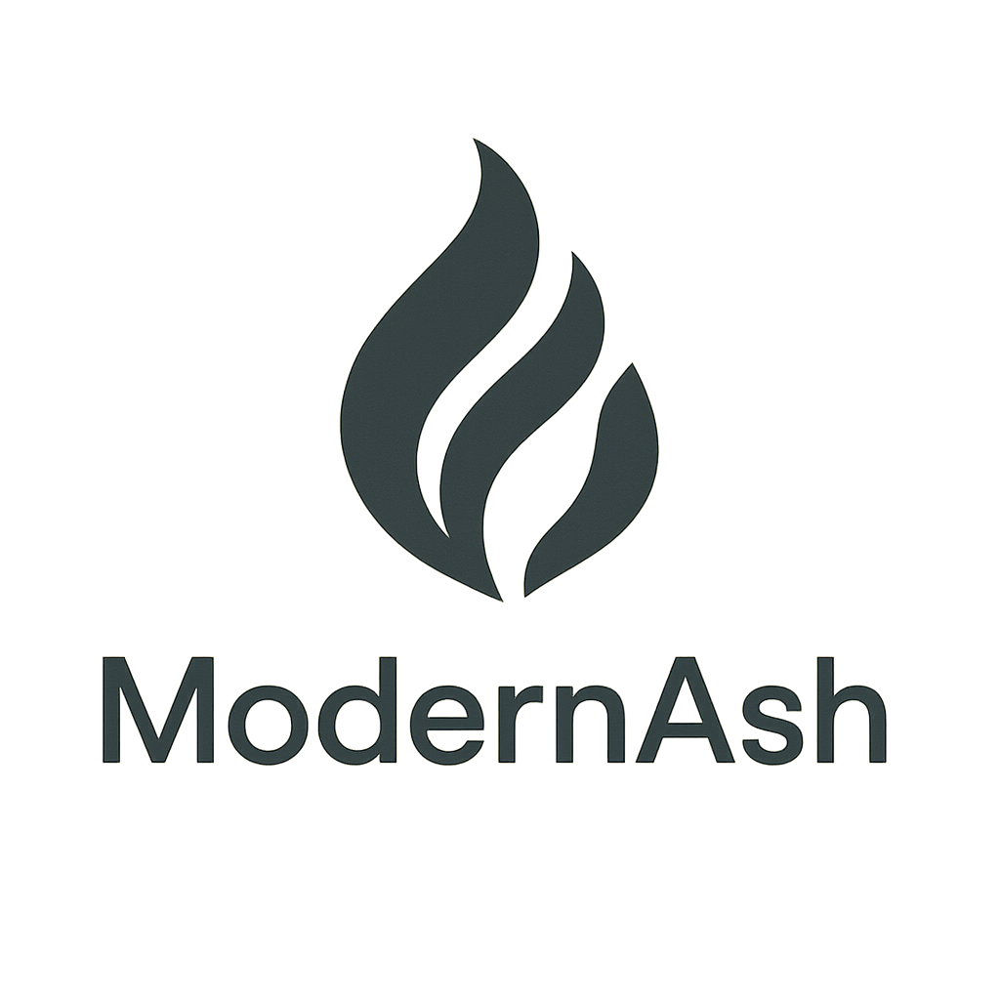

  

# ModernAsh DevEngage.AI – GenAI-Driven Engineering Enablement on AWS

**Short description**

Enable your engineering teams to adopt **generative AI (GitHub Copilot, LLMs, agentic workflows)** across the entire software development lifecycle. ModernAsh DevEngage.AI designs and implements an **AI-augmented, language-agnostic operating model**, compatible with **Scrum, Kanban and variants**, to improve product quality, security, test coverage, documentation, and throughput by treating AI as an **additional team member**.

---

## Overview

ModernAsh DevEngage.AI is a consulting and professional services engagement that helps development teams integrate **generative AI as an active contributor** in their day-to-day work, not just as another tool.

We focus on:

- Making AI **agentic**: AI systems that work from **goals and specs**, interact with your repositories and tools, and produce **concrete artifacts** (code, tests, docs, refactors).  
- Embedding AI into **real-world delivery workflows**, including **Scrum, Kanban, Scrumban, SAFe, and custom frameworks**.  
- Being **agnostic to programming language and stack**: Java, Python, Node.js, .NET, front-end, mobile, data/ML, and more.  
- Improving:
  - Product **quality**  
  - **Security** posture of the code  
  - **Test coverage** and reliability  
  - **Documentation** level and freshness  
  - Overall **throughput**, by offloading repetitive, non-creative tasks to AI

We introduce and reinforce **Spec Driven Development (SDD)**: a way of working where specifications (specs) are the central artifact, and both humans and AI collaborate to generate code, tests, and documentation aligned to those specs.

This engagement is **team-topology-agnostic** and **workflow-agnostic**: it can be embedded into cross-functional squads, component teams, platform teams, or any structure you already have, without forcing you to change your delivery framework.

---

## Key Benefits

- **Higher product quality**  
  Better structured code, consistent patterns, and higher test coverage.

- **Improved security**  
  Systematic support for secure coding practices, AI assistance to spot insecure patterns, and alignment with your existing security tooling.

- **More testing with less friction**  
  Generative AI assists in creating and maintaining **unit, integration, and end-to-end tests** from specs and existing code.

- **Better documentation with minimal overhead**  
  AI-generated and AI-assisted **README files, HOWTOs, inline comments, architectural notes, and changelogs** that stay closer to reality.

- **Higher throughput and more focus on creativity**  
  Repetitive, low-value tasks (boilerplate, scaffolding, documentation, many tests) become the responsibility of AI, freeing humans for architecture, design, and product thinking.

- **Compatible with how you already work**  
  Works with **Scrum, Kanban, Scrumban, SAFe and derivatives**, and can be introduced incrementally per team.

---

## Typical Use Cases

- Organizations that want to adopt **GitHub Copilot, AI coding assistants, and agentic AI** in a **structured, governed** way.  
- Engineering leaders aiming to:
  - Increase **productivity** without sacrificing quality or security.  
  - Boost **test coverage and documentation** using AI.  
  - Standardize how AI is used across teams, languages, and workflows.  
- Teams working in **Scrum or Kanban** that want to embed AI into their sprint/flow instead of using it “on the side”.  
- Companies that want to **experiment with generative AI in software engineering** but need **guardrails, governance, and measurable impact**.

---

## What You Get (Deliverables)

By the end of the engagement, you receive:

### 1. GenAI Engineering Assessment & Readiness Report

- Assessment of current:
  - Tech stack and tooling (IDEs, repos, CI/CD, code review practices).  
  - Delivery processes (Scrum, Kanban, etc.) and team topology.  
  - Current or planned use of generative AI tools.  
- Identification of:
  - High-impact AI use cases (code, tests, docs, security, refactor, etc.).  
  - Risks and constraints (compliance, data protection, security).  
- A **readiness and maturity report** with prioritized opportunities and recommended first steps.

---

### 2. AI-Augmented Operating Model for Engineering

- Definition of an **“AI as a team member”** model:
  - Which tasks are delegated to AI, and which remain human-only.  
  - Where and when AI participates in the lifecycle (refinement, coding, review, docs, testing).  
  - How roles (developers, tech leads, architects, QA, SRE) interact with AI and review its outputs.  
- Workflow designs tailored to your context:
  - For **Scrum**: how AI fits into backlog refinement, sprint planning, development, review, and retrospective.  
  - For **Kanban / flow-based** teams: how AI is integrated into the board and value stream without adding bottlenecks.  
- Governance and guardrails:
  - Approval rules for AI-generated artifacts.  
  - Minimal quality and security criteria.  
  - Logging and traceability of AI contributions where required.

**Deliverable:** an **AI Augmented SDLC Playbook** customized for your teams.

---

### 3. Spec Driven Development (SDD) Framework

- Definition of **spec templates** (typically in Markdown or your standard format) that include:
  - Context and objectives.  
  - Functional and non-functional requirements.  
  - Edge cases, error scenarios, and security constraints.  
- Integration of SDD into your existing tools:
  - Backlog items (e.g., Jira, GitHub Issues, Azure Boards).  
  - PR templates and CI/CD checks.  
- Examples of **real specs** linked to:
  - AI-generated or AI-assisted code.  
  - AI-generated test suites.  
  - AI-generated documentation.

**Deliverable:** a **Spec Driven Development guide and template set** adapted to your teams and workflows.

---

### 4. Implementation of AI-Augmented Workflows

- Configuration of:
  - Generative AI assistants (GitHub Copilot or alternatives, subject to your tooling and policies).  
  - Agentic workflows for:
    - Code scaffolding and repetitive coding tasks.  
    - Generation and maintenance of **unit and integration tests**.  
    - Documentation (README, HOWTOs, inline comments, changelogs).  
    - Suggesting refactors and highlighting code smells.  
- Optional integration with **AWS-native tooling** (e.g., CodeCommit, CodeBuild, CodePipeline, CodeCatalyst) and existing security tools.

**Deliverable:** working examples in your own repositories, with AI-assisted pull requests and automations that your team can inspect and own.

---

### 5. Training, Coaching & Adoption Toolkit

- Practical workshops for engineers, tech leads, and managers on:
  - Effective use of generative AI for coding, testing, and documentation.  
  - How to write good specs and prompts.  
  - How to review and accept AI-generated artifacts.  
- Hands-on coaching with your squads:
  - Reviewing PRs and tasks where AI was involved.  
  - Adjusting workflows based on feedback and team preferences.  
- An adoption toolkit:
  - Best practices, dos and don’ts.  
  - FAQ and reference materials for new joiners.

---

### 6. Metrics & Continuous Improvement Plan

- Definition of **metrics** to track impact, such as:
  - Lead time and cycle time for features.  
  - Test coverage and defect rates.  
  - Documentation coverage (e.g., % of modules with README/HOWTO).  
  - Usage patterns of AI tools.  
- Recommendations for:
  - Continuous tuning of AI workflows.  
  - Scaling from 1–2 teams to many teams.  
  - Periodic reviews of governance and guardrails.

**Deliverable:** a **DevEngage.AI Scorecard** and a roadmap to scale.

---

## Engagement Model & Typical Timeline

**Typical duration:** 4–8 weeks for 1–2 teams (can be adapted).

### Phase 1 – Discovery & Assessment

- Stakeholder interviews (engineering, security, product).  
- Assessment of current tooling, processes, and constraints.  
- Readiness and opportunity analysis.

### Phase 2 – Operating Model & SDD Design

- Design of the **AI-augmented SDLC model** for your teams.  
- Creation of SDD templates and workflow diagrams.  
- Alignment with your Scrum/Kanban practices and team topology.

### Phase 3 – Implementation & Hands-On Integration

- Setup of AI tools and workflows in your environment.  
- Creation of real examples (code, tests, docs) using your actual backlog items.  
- Integration with CI/CD and existing review practices.

### Phase 4 – Training, Coaching & Metrics

- Workshops and coaching sessions with the teams.  
- Setup of metrics and dashboards where feasible.  
- Adjustments based on early feedback and quick wins.

---

## How We Use AI (Safety & Governance)

ModernAsh treats generative AI as a powerful accelerator that must be used responsibly.

- AI is used to **assist**, not replace, human decision-making.  
- We align with your policies on:
  - Data residency and privacy.  
  - Source code confidentiality and IP.  
  - Use (or non-use) of external AI models with proprietary code.  
- We encourage:
  - Clear guidelines on when AI-generated content must be reviewed.  
  - Traceability where needed (e.g., PR templates indicating AI assistance).  
  - Periodic review of security and compliance implications.

---

## Customer Prerequisites

To ensure a successful engagement, we expect:

- At least one **sponsor in engineering leadership** and one **team willing to adopt AI** in their day-to-day work.  
- Access to:
  - Example repositories and pipelines.  
  - The backlog/issue tracker used by the team.  
- Agreement on:
  - Basic AI usage policies (or willingness to define them with us).  
  - Clear success criteria (e.g., test coverage, documentation, throughput, defects).

This service is **agnostic to programming language and stack** and works with **Scrum, Kanban, and derivatives**, so no change in process framework is required.

---

## Pricing

This is a **fixed-scope consulting engagement** with optional extensions.

- Base engagement for **1–2 teams** over **4–8 weeks**, including assessment, design, implementation, training, and early metrics.  
- Extensions for:
  - Additional teams or business units.  
  - Deeper automation or bespoke agent development.  
  - Ongoing coaching and periodic health checks.

Final pricing will be agreed with you and documented in an **AWS Marketplace Private Offer**, aligned with your procurement and budgeting processes.

---

## From Initial Engagement to Organization-Wide Rollout

The initial engagement is designed to:

- Prove value with **real teams and real work**.  
- Establish a **reusable model, templates, and tooling**.

Afterwards, ModernAsh can support:

- Rolling out DevEngage.AI to additional teams and units.  
- Deepening automation and agent capabilities.  
- Periodic reviews of metrics, governance, and ROI.

---

## Support

During the engagement, ModernAsh provides:

- Email and chat support during business hours (US time zones).  
- Regular working sessions and status updates.  
- Access to all documentation, templates, and code samples created as part of the engagement.

Additional support and follow-on services can be defined as separate professional services engagements via AWS Marketplace.

---

## Data Protection & Confidentiality

ModernAsh works under **Mutual NDAs and service agreements** that protect:

- Confidentiality of your source code and documentation.  
- Privacy and security of any data used during the engagement.  
- Your IP and proprietary workflows.

We can align with your legal and compliance requirements and the AWS Marketplace **Standard Contract for Professional Services**, with modifications via **Private Offer** where needed.

---

## About ModernAsh

ModernAsh is a consulting and professional services company focused on:

- **Legacy-to-modern modernization** (applications and architectures on AWS).  
- **AI-assisted engineering**, including code, tests, and documentation.  
- **AI-augmented ways of working** for engineering teams.

With **ModernAsh DevEngage.AI**, we help organizations bring generative AI into real development workflows—improving quality, security, testing, documentation, and productivity across teams, technologies, and delivery frameworks.
