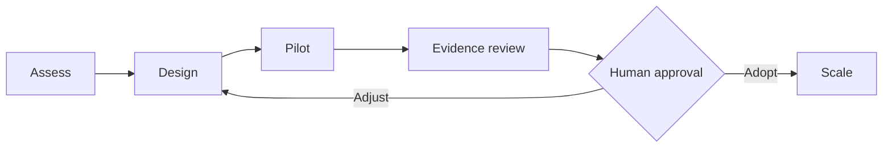

  

# DevEngage.AI — One-pager y oferta de actividades

## Definición

**DevEngage.AI es el servicio profesional de adopción de Agora.** Ayuda a una organización a pasar del uso informal de asistentes y agentes a un piloto de delivery con actores, roles, permisos, gates, evidencia y aprobaciones explícitas.

Agora es el producto open source. DevEngage.AI aporta assessment, diseño, implementación, coaching y roadmap.

## Para quién

- CTOs, VPs of Engineering y Heads of Delivery que ya tienen agentes o asistentes en uso.
- Organizaciones que necesitan trazabilidad, límites de autoridad y evidencia verificable.
- Equipos que quieren evaluar IA sobre trabajo real sin transformar toda la organización de una vez.
- Seguridad, Riesgo o Compliance que necesitan participar en el diseño del modelo.

## Resultado esperado

Un piloto controlado en un repositorio real que permita responder:

1. ¿Quién o qué ejecutó cada acción?
2. ¿Qué autoridad y límites tenía?
3. ¿Qué evidencia produjo?
4. ¿Qué gate habilitó el avance?
5. ¿Quién revisó y aceptó el resultado?

## Oferta de actividades

### 1. AI Delivery Governance Assessment

**Duración orientativa:** 2–3 semanas.

Relevamiento de equipos, procesos, herramientas, repositorios, uso actual de IA, riesgos y restricciones. Incluye selección del caso piloto y roadmap inicial.

**Entregables:** mapa de madurez, riesgos, oportunidades, repositorio candidato y criterios de éxito.

### 2. Governed Delivery Design Workshop

**Duración orientativa:** 1–2 jornadas de trabajo más preparación.

Diseño colaborativo de actores, roles, capacidades, lifecycle, gates, evidencia y autoridad de aprobación. Selección o adaptación del Method Pack.

**Entregables:** modelo operativo del piloto, matriz de autoridad, gates, evidencia y plan de implementación.

### 3. Agora Controlled Pilot

**Duración orientativa:** 4–8 semanas sobre un equipo y un repositorio.

Adopción técnica de Agora, configuración del workflow y ejecución de trabajo real con acompañamiento de ModernAsh.

**Entregables:** repositorio gobernado, configuración `.agora/`, casos reales, registros durables, evidencia, coaching y evaluación final.

### 4. Adoption & Scale

**Formato:** engagement posterior al piloto.

Capacitación, consolidación del playbook, diseño de onboarding, revisión periódica del modelo y expansión gradual a otros equipos.

**Entregables:** playbook operativo, materiales de capacitación, backlog de mejoras, métricas y roadmap de expansión.

## Arquitectura mínima del piloto

## Principios

- La autoridad no se infiere: se declara.
- Un resultado no sustituye la evidencia.
- Un check técnico no equivale a aceptación.
- El registro debe sobrevivir al chat y a la sesión.
- El proveedor LLM y el proceso siguen siendo elecciones del cliente.
- La adopción se decide con evidencia del piloto.

## Contratación

DevEngage.AI se estructura como Professional Services con alcance, responsabilidades, criterios de aceptación y precio acordados. Cualquier referencia a AWS Marketplace debe considerarse un borrador hasta confirmar listing y Private Offer.

## CTA

- Servicio: <https://modern-ash.com/devengage/>
- Producto: <https://modern-ash.com/agora/>
- Contacto: <https://modern-ash.com/contacto/>
